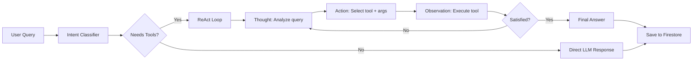

# Comprehensive Implementation Plan
## AI-Powered Portfolio: chirag127.in

---

## 1. Architecture Overview

```mermaid
graph TB
    subgraph "GitHub Actions (Daily 2AM IST)"
        CRON[Cron Trigger] --> FETCH[fetch-data.ts]
        FETCH --> API_LAYER[15 API Modules]
        API_LAYER --> JSON[Generated JSON Files]
        JSON --> BUILD[Astro SSG Build]
        JSON --> FS_PUSH[Push Summaries → Firestore]
    end

    subgraph "Cloudflare Pages (Static)"
        BUILD --> PAGES[Static HTML Hub Pages]
        PAGES --> MOVIES[/library/movies]
        PAGES --> BOOKS[/library/books]
        PAGES --> MUSIC[/library/music]
        PAGES --> ANIME[/library/anime]
        PAGES --> GAMING[/gaming]
        PAGES --> CODE[/code]
        PAGES --> SOCIAL[/connect]
    end

    subgraph "Client-Side (Browser)"
        CHAT[AI Chat Agent] --> PUTER[Puter.js Free Models]
        CHAT --> FS_READ[Read Firestore Context]
        CHAT --> TOOLS[Tool Orchestrator]
        TOOLS --> FS_QUERY[Query Firestore Data]
        ADMIN[Admin Dashboard] --> FS_ADMIN[Firestore Admin]
    end

    subgraph "Firebase Firestore"
        FS_PUSH --> MEDIA_COL[media/* collections]
        FS_READ --> MEDIA_COL
        FS_QUERY --> MEDIA_COL
        CHAT --> CHAT_COL[chats/* collection]
        FS_ADMIN --> MEDIA_COL
        FS_ADMIN --> CHAT_COL
    end
```

### Data Flow
1. **GitHub Actions cron** runs daily at 2:00 AM IST (20:00 UTC)
2. **`fetch-data.ts`** calls all 15 APIs server-side (keys safe as GH Secrets)
3. **JSON files** saved to `src/data/generated/` (gitignored)
4. **Firestore** receives UPDATE (overwrite same doc IDs — free tier safe)
5. **Astro SSG** reads JSON → generates static hub pages
6. **Cloudflare Pages** serves the static site
7. **Client-side AI agent** queries Firestore data + uses Puter.js free models

### Key Constraints
- **Firestore free tier:** 1 GiB storage, 50K reads/day, 20K writes/day
- **UPDATE strategy:** Overwrite `media/movies`, `media/books`, etc. as single documents — never accumulate
- **All data public:** Every visitor can read all data (movies, books, chats)
- **Admin write-only:** Only `whyiswhen@gmail.com` can modify data via dashboard
- **Zero cost:** No paid APIs, no paid hosting, no paid LLMs

---

## 2. Free Puter.js Models

| Model ID | Params | Active | Best For | Context |
|----------|--------|--------|----------|---------|
| `arcee-ai/trinity-large-preview:free` | 400B | 13B | Creative writing, tool use, agentic coding, multi-turn | 128K |
| `liquid/lfm-2.5-1.2b-instruct:free` | 1.2B | 1.2B | Instruction following, agentic tasks, RAG, data extraction | 32K |
| `liquid/lfm-2.5-1.2b-thinking:free` | 1.2B | 1.2B | Chain-of-thought reasoning, fewer output tokens | 32K |
| `google/gemma-3n-e2b-it:free` | 2B | 2B | General instruction following, fast responses | 8K |
| `qwen/qwen3-4b:free` | 4B | 4B | General chat, multilingual, balanced | 32K |

### Model Routing Strategy

```typescript
// Intelligent model selection based on query complexity
const MODEL_ROUTING = {
  // Fast: simple greetings, FAQs, navigation
  fast: [
    'qwen/qwen3-4b:free',
    'google/gemma-3n-e2b-it:free',
    'liquid/lfm-2.5-1.2b-instruct:free',
  ],
  // Reasoning: complex questions, analysis, coding
  reasoning: [
    'liquid/lfm-2.5-1.2b-thinking:free',
    'arcee-ai/trinity-large-preview:free',
    'qwen/qwen3-4b:free',
  ],
  // Agent: tool calling, multi-step, data queries
  agent: [
    'arcee-ai/trinity-large-preview:free',
    'liquid/lfm-2.5-1.2b-thinking:free',
    'qwen/qwen3-4b:free',
  ],
};
```

Each tier has a **failover chain** — if the first model fails, the next is tried automatically.

---

## 3. Advanced Agentic AI Architecture

### ReAct (Reason + Act) Agent Loop



### Agent Components

#### 3a. Intent Classifier ([src/lib/ai/classifier.ts](file:///c:/AM/GitHub/m2/src/lib/ai/classifier.ts))
```
Intents: career | coding | projects | skills | movies |
         music | books | anime | gaming | stats |
         social | contact | navigation | greeting |
         meta | unknown
```
- Regex-first for speed (zero LLM cost on known patterns)
- LLM fallback only for ambiguous queries

#### 3b. Tool Registry (`src/lib/ai/tools/registry.ts`)
| Tool | Description | Data Source |
|------|-------------|-------------|
| [getMovies](file:///c:/AM/GitHub/m2/src/lib/ai/tools/media.ts#6-17) | Watched, watchlist, ratings, stats | Firestore `media/movies` |
| [getBooks](file:///c:/AM/GitHub/m2/src/lib/ai/tools/media.ts#22-30) | Reading log, want-to-read, stats | Firestore `media/books` |
| [getMusic](file:///c:/AM/GitHub/m2/src/lib/ai/tools/media.ts#18-21) | Top artists, tracks, albums, scrobbles | Firestore `media/music` |
| `getAnime` | Anime/manga lists, scores, stats | Firestore `media/anime` |
| `getGaming` | Steam games, playtime, lichess | Firestore `media/gaming` |
| `getCoding` | GitHub, LeetCode, Codewars, WakaTime | Firestore `media/coding` |
| `getSocial` | Bluesky posts, Dev.to, YouTube, HN | Firestore `media/social` |
| `getResume` | Education, experience, skills | Static knowledge base |
| `getProjects` | All projects with descriptions | Static knowledge base |
| `getContactInfo` | Email, social links | Static config |
| `navigateTo` | Returns URL for a page | Static sitemap |

#### 3c. Context Builder ([src/lib/ai/context.ts](file:///c:/AM/GitHub/m2/src/lib/ai/context.ts))
Builds system prompt dynamically:
1. Base persona (name, role, links)
2. Injected data from relevant tool outputs
3. User-selected personality mode
4. Recent conversation history (last 5 messages)
5. Sitemap of all hub pages

#### 3d. Personality Modes (user-selectable)
| Mode | System Prompt Modifier |
|------|----------------------|
| **Professional** | Concise, formal, data-driven responses |
| **Casual** | Friendly, conversational, uses emoji |
| **Witty** | Humorous, playful, adds personality |
| **Technical** | Detailed, code-heavy, developer-focused |

#### 3e. Agent Memory & Persistence
- **Chat sessions** → `chats/{sessionId}/messages` in Firestore
- **All data visible** to everyone (no auth required to read)
- **Admin only** can delete/modify via dashboard
- **Unknown queries** → EmailJS alert to `whyiswhen@gmail.com`
- **Preferences** → extracted and stored per session

---

## 4. Complete Platform Matrix (15 APIs)

### 🎬 Movies & TV
| Platform | API | Auth | Data |
|----------|-----|------|------|
| **Trakt** | REST `api.trakt.tv/users/chirag127` | `client_id` header | Watched, watchlist, ratings, history, stats |
| **TMDB** | REST `api.themoviedb.org/3` | `api_key` param | Posters, metadata, cast, genres, trailers |
| **Letterboxd** | RSS `letterboxd.com/chirag127/rss` | None | Recent diary, ratings |

**Hub Page Sections:** Currently Watching • Watched (sorted by rating) • Watchlist • Top Rated • Stats (total, avg rating, top genres, total hours) • Profile Links

---

### 📚 Books
| Platform | API | Auth | Data |
|----------|-----|------|------|
| **OpenLibrary** | REST `openlibrary.org/people/wilarchive` | None | Reading log, covers, metadata |

**Hub Page Sections:** Currently Reading • Read • Want to Read • Stats • Profile Link

---

### 🎵 Music
| Platform | API | Auth | Data |
|----------|-----|------|------|
| **Last.fm** | REST `ws.audioscrobbler.com/2.0` (user: `lastfmwhy`) | `api_key` | Top artists/tracks/albums, scrobbles, loved |
| **Spotify** | REST `api.spotify.com/v1` | OAuth `refresh_token` | Top tracks, top artists, recently played |

**Hub Page Sections:** Top Artists • Top Tracks • Top Albums • Recent Listens • Scrobble Stats • Profile Links

---

### 🎌 Anime & Manga
| Platform | API | Auth | Data |
|----------|-----|------|------|
| **AniList** | GraphQL `graphql.anilist.co` (user: `chirag127`) | None | Anime/manga lists, scores, favorites, stats |
| **Jikan** | REST `api.jikan.moe/v4` | None | MAL data backup |

**Hub Page Sections:** Watching • Completed • Plan to Watch • Dropped • Manga • Stats • Profile Link

---

### 🎮 Gaming
| Platform | API | Auth | Data |
|----------|-----|------|------|
| **Steam** | REST `api.steampowered.com` | `api_key` | Owned games, playtime, achievements |
| **Lichess** | REST `lichess.org/api/user/chirag127` | None | Ratings, games, wins/losses |

**Hub Page Sections:** Steam Library (by playtime) • Recent Games • Achievements • Chess Stats • Profile Links

---

### 💻 Coding & Developer
| Platform | API | Auth | Data |
|----------|-----|------|------|
| **GitHub** | REST `api.github.com/users/chirag127` | `token` (optional) | Repos, stars, languages, contributions |
| **WakaTime** | REST `wakatime.com/api/v1` | `api_key` | Coding time, languages, projects, editors |
| **LeetCode** | GraphQL `leetcode.com/graphql` | None | Solved, easy/medium/hard, ranking |
| **Codewars** | REST `codewars.com/api/v1/users/chirag127` | None | Rank, honor, kata, languages |
| **Dev.to** | REST `dev.to/api/articles?username=chirag127` | `api_key` (optional) | Articles, reactions, comments |
| **HackerNews** | REST `hacker-news.firebaseio.com` | None | Karma, submissions |

**Hub Page Sections:** GitHub Repos • Language Breakdown • WakaTime Dashboard • LeetCode Stats • Codewars Rank • Articles • Profile Links

---

### 🌐 Social
| Platform | API | Auth | Data |
|----------|-----|------|------|
| **Bluesky** | REST AT Protocol (handle: `chirag127.bsky.social`) | `app_password` | Posts, followers |
| **YouTube** | REST `googleapis.com/youtube/v3` | `api_key` | Channel stats, videos |

**Hub Page Sections:** Recent Posts • YouTube Videos • Profile Links

---

## 5. Firestore Schema

```
firestore/
├── media/
│   ├── movies      (1 doc, overwritten daily)
│   ├── books       (1 doc, overwritten daily)
│   ├── music       (1 doc, overwritten daily)
│   ├── anime       (1 doc, overwritten daily)
│   ├── gaming      (1 doc, overwritten daily)
│   ├── coding      (1 doc, overwritten daily)
│   └── social      (1 doc, overwritten daily)
├── chats/
│   └── {sessionId}/
│       └── messages (subcollection)
├── analytics/
│   └── queries     (1 doc, counters)
└── admin/
    └── config      (1 doc, admin settings)
```

**Free tier math:** 7 media docs overwritten daily = 7 writes/day. Chats = variable. Well within 20K writes/day limit. Each media doc stays under 1MB (Firestore limit per doc).

---

## 6. File Structure (New/Modified Files)

```
c:\AM\GitHub\m2\
├── .github/
│   └── workflows/
│       └── daily-build.yml          [NEW]
├── scripts/
│   └── fetch-data.ts                [NEW]
├── src/
│   ├── data/
│   │   └── generated/               [NEW, gitignored]
│   │       ├── movies.json
│   │       ├── books.json
│   │       ├── music.json
│   │       ├── anime.json
│   │       ├── games.json
│   │       ├── coding.json
│   │       └── social.json
│   ├── lib/
│   │   ├── api/
│   │   │   ├── types.ts             [NEW] ✅ Created
│   │   │   ├── fetcher.ts           [NEW] ✅ Created
│   │   │   ├── trakt.ts             [NEW]
│   │   │   ├── tmdb.ts              [NEW]
│   │   │   ├── lastfm.ts            [NEW]
│   │   │   ├── spotify.ts           [NEW]
│   │   │   ├── openlibrary.ts       [NEW]
│   │   │   ├── anilist.ts           [NEW]
│   │   │   ├── jikan.ts             [NEW]
│   │   │   ├── steam.ts             [NEW]
│   │   │   ├── wakatime.ts          [NEW]
│   │   │   ├── github-api.ts        [NEW]
│   │   │   ├── leetcode.ts          [NEW]
│   │   │   ├── codewars.ts          [NEW]
│   │   │   ├── devto.ts             [NEW]
│   │   │   ├── bluesky.ts           [NEW]
│   │   │   ├── youtube.ts           [NEW]
│   │   │   └── hackernews.ts        [NEW]
│   │   └── ai/
│   │       ├── agent.ts             [MODIFY]
│   │       ├── engine.ts            [MODIFY]
│   │       ├── context.ts           [MODIFY]
│   │       ├── classifier.ts        [MODIFY]
│   │       ├── store.ts             [MODIFY]
│   │       └── tools/
│   │           ├── registry.ts      [NEW]
│   │           ├── media.ts         [MODIFY]
│   │           └── client.ts        [KEEP]
│   ├── pages/
│   │   ├── library/
│   │   │   ├── movies.astro         [MODIFY]
│   │   │   ├── books.astro          [MODIFY]
│   │   │   ├── music.astro          [MODIFY]
│   │   │   └── anime.astro          [MODIFY]
│   │   ├── gaming/
│   │   │   └── index.astro          [MODIFY]
│   │   ├── code/
│   │   │   └── index.astro          [MODIFY]
│   │   └── connect/
│   │       └── index.astro          [NEW/MODIFY]
│   └── components/islands/
│       ├── AIChat.tsx               [MODIFY]
│       ├── GlobalChatButton.tsx     [MODIFY]
│       └── AdminDashboard.tsx       [MODIFY]
├── .env.example                     [MODIFIED] ✅ Done
├── .gitignore                       [MODIFIED] ✅ Done
└── wrangler.toml                    [NEW]
```

---

## 7. GitHub Actions CI/CD

```yaml
# .github/workflows/daily-build.yml
name: Daily Build & Deploy
on:
  schedule:
    - cron: '0 20 * * *'  # 2:00 AM IST
  push:
    branches: [main]
  workflow_dispatch:

jobs:
  build-and-deploy:
    runs-on: ubuntu-latest
    steps:
      - uses: actions/checkout@v4
      - uses: pnpm/action-setup@v4
        with: { version: 10 }
      - uses: actions/setup-node@v4
        with: { node-version: 22, cache: pnpm }
      - run: pnpm install --frozen-lockfile

      - name: Fetch API Data
        run: pnpm run fetch-data
        env:
          TRAKT_CLIENT_ID: ${{ secrets.TRAKT_CLIENT_ID }}
          TMDB_API_KEY: ${{ secrets.TMDB_API_KEY }}
          LASTFM_API_KEY: ${{ secrets.LASTFM_API_KEY }}
          SPOTIFY_CLIENT_ID: ${{ secrets.SPOTIFY_CLIENT_ID }}
          SPOTIFY_CLIENT_SECRET: ${{ secrets.SPOTIFY_CLIENT_SECRET }}
          SPOTIFY_REFRESH_TOKEN: ${{ secrets.SPOTIFY_REFRESH_TOKEN }}
          STEAM_API_KEY: ${{ secrets.STEAM_API_KEY }}
          STEAM_USER_ID: ${{ secrets.STEAM_USER_ID }}
          GITHUB_TOKEN: ${{ secrets.GH_PAT }}
          WAKATIME_API_KEY: ${{ secrets.WAKATIME_API_KEY }}
          DEVTO_API_KEY: ${{ secrets.DEVTO_API_KEY }}
          BLUESKY_HANDLE: ${{ secrets.BLUESKY_HANDLE }}
          BLUESKY_APP_PASSWORD: ${{ secrets.BLUESKY_APP_PASSWORD }}
          YOUTUBE_API_KEY: ${{ secrets.YOUTUBE_API_KEY }}
          YOUTUBE_CHANNEL_ID: ${{ secrets.YOUTUBE_CHANNEL_ID }}
          # Firebase (for Firestore push)
          FIREBASE_PROJECT_ID: ${{ secrets.FIREBASE_PROJECT_ID }}
          FIREBASE_CLIENT_EMAIL: ${{ secrets.FIREBASE_CLIENT_EMAIL }}
          FIREBASE_PRIVATE_KEY: ${{ secrets.FIREBASE_PRIVATE_KEY }}

      - name: Build Site
        run: pnpm run build
        env:
          VITE_FIREBASE_API_KEY: ${{ secrets.VITE_FIREBASE_API_KEY }}
          VITE_FIREBASE_AUTH_DOMAIN: ${{ secrets.VITE_FIREBASE_AUTH_DOMAIN }}
          VITE_FIREBASE_PROJECT_ID: ${{ secrets.VITE_FIREBASE_PROJECT_ID }}
          VITE_FIREBASE_STORAGE_BUCKET: ${{ secrets.VITE_FIREBASE_STORAGE_BUCKET }}
          VITE_FIREBASE_MESSAGING_SENDER_ID: ${{ secrets.VITE_FIREBASE_MESSAGING_SENDER_ID }}
          VITE_FIREBASE_APP_ID: ${{ secrets.VITE_FIREBASE_APP_ID }}

      - name: Deploy to Cloudflare Pages
        uses: cloudflare/wrangler-action@v3
        with:
          apiToken: ${{ secrets.CLOUDFLARE_API_TOKEN }}
          accountId: ${{ secrets.CLOUDFLARE_ACCOUNT_ID }}
          command: pages deploy dist --project-name=chirag127
```

---

## 8. Cloudflare Pages Setup

1. Go to [dash.cloudflare.com](https://dash.cloudflare.com) → Pages
2. Create project named `chirag127`
3. Skip Git connection (deploying via GH Actions)
4. Set custom domain: `chirag127.in` and `me.oriz.in`
5. Get API Token: My Profile → API Tokens → Create Token → "Cloudflare Pages Edit"
6. Get Account ID: from dashboard URL or Overview page
7. Add `CLOUDFLARE_API_TOKEN` and `CLOUDFLARE_ACCOUNT_ID` to GitHub Secrets

---

## 9. EmailJS Setup

1. Go to [emailjs.com](https://www.emailjs.com/) → Sign up free
2. **Email Service:** Add Service → Gmail → connect `whyiswhen@gmail.com`
3. **Template:** Create with variables:
   - Subject: `🤖 Unknown Query Alert: {{query}}`
   - Body: `Query: {{query}}\nIntent: {{intent}}\nConfidence: {{confidence}}\nResponse: {{context}}\nTimestamp: {{timestamp}}\nSession: {{sessionId}}`
4. **API Keys:** Account → API Keys → copy Public Key
5. Add to [.env](file:///c:/AM/GitHub/m2/.env): `VITE_EMAILJS_SERVICE_ID`, `VITE_EMAILJS_TEMPLATE_ID`, `VITE_EMAILJS_PUBLIC_KEY`

---

## 10. Firestore Security Rules

```javascript
rules_version = '2';
service cloud.firestore {
  match /databases/{database}/documents {
    // All data readable by everyone
    match /{document=**} {
      allow read: if true;
    }
    // Only admin can write
    match /{document=**} {
      allow write: if request.auth != null
        && request.auth.token.email
        == 'whyiswhen@gmail.com';
    }
    // Chat messages — anyone can create new
    match /chats/{sessionId}/messages/{messageId} {
      allow create: if true;
    }
    // Analytics — anyone can increment counters
    match /analytics/{doc} {
      allow update: if true;
    }
  }
}
```

---

## 11. Frontend Premium Design

### Design System
- **Typography:** Satoshi (display) + JetBrains Mono (code) from Google Fonts
- **Color Palette:** Deep midnight blue (`#0a0e27`) base, electric cyan (`#00f0ff`) accents, warm amber (`#ffbe0b`) highlights
- **Effects:** Glassmorphism cards, gradient mesh backgrounds, noise texture overlays, CSS `backdrop-filter: blur()`
- **Animations:** Staggered reveal on scroll (IntersectionObserver), hover parallax on cards, pulsing glow on chat FAB
- **Layout:** Asymmetric grids, generous negative space, overlapping sections
- **Dark mode:** Default (matches portfolio vibe), with light mode toggle

### Hub Page Design Pattern
Each hub page follows this structure:
1. **Hero banner** with gradient mesh + page title + profile link buttons
2. **Stats bar** — key metrics in glassmorphic cards with counter animations
3. **Content sections** — filterable grid of items (poster + title + metadata)
4. **Section dividers** — animated gradient lines
5. **Footer CTA** — "Ask AI about my [category]" button

---

## 12. Verification Plan

### Automated
1. `pnpm run fetch-data` — verify all 15 APIs return data, JSON files created
2. `pnpm run build` — zero errors, all pages generated
3. `pnpm run dev` — visual verification of all hub pages
4. GitHub Actions workflow → manual trigger → verify deployment

### AI Agent Tests
- "What movies has Chirag watched?" → returns movie list from Firestore
- "What are his top programming languages?" → returns WakaTime/GitHub data
- "Tell me about his anime taste" → returns AniList data
- "What's his LeetCode ranking?" → returns stats
- Switch personality modes → verify tone changes

### Admin Dashboard
- Login with `whyiswhen@gmail.com` → see all media data
- Verify chat logs visible with clear formatting
- Verify search/filter works across all collections

---

## 13. Environment Variables Summary

See [.env.example](file:///c:/AM/GitHub/m2/.env.example) for step-by-step setup instructions for every key.

| Category | Variable | Required? |
|----------|----------|-----------|
| Firebase | `VITE_FIREBASE_*` (7 vars) | ✅ Yes |
| EmailJS | `VITE_EMAILJS_*` (3 vars) | ✅ Yes |
| Trakt | `TRAKT_CLIENT_ID` | ✅ Yes |
| TMDB | `TMDB_API_KEY` | ✅ Yes |
| Last.fm | `LASTFM_API_KEY` | ✅ Yes |
| Spotify | `SPOTIFY_*` (3 vars) | ✅ Yes |
| Steam | `STEAM_API_KEY`, `STEAM_USER_ID` | ✅ Yes |
| GitHub | `GITHUB_TOKEN` | Optional |
| WakaTime | `WAKATIME_API_KEY` | ✅ Yes |
| Dev.to | `DEVTO_API_KEY` | Optional |
| Bluesky | `BLUESKY_HANDLE`, `BLUESKY_APP_PASSWORD` | ✅ Yes |
| YouTube | `YOUTUBE_API_KEY`, `YOUTUBE_CHANNEL_ID` | Optional |
| Cloudflare | `CLOUDFLARE_API_TOKEN`, `CLOUDFLARE_ACCOUNT_ID` | ✅ Yes (GH Secrets) |
| Firebase Admin | `FIREBASE_PROJECT_ID`, `FIREBASE_CLIENT_EMAIL`, `FIREBASE_PRIVATE_KEY` | ✅ Yes (GH Secrets) |
